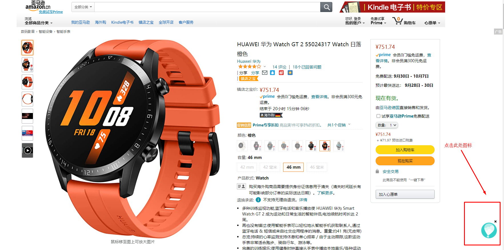
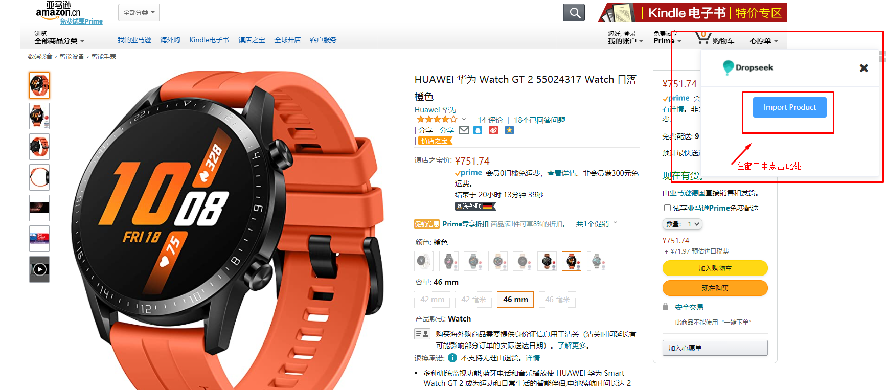

# 亚马逊商品导入

**使用方法**

Dropseek同样支持亚马逊的商品导入。进入要导入的商品详情页中点击热气球图标 -> 点击“Import Product”。当窗口显示“Import Success”时，导入成功。

**未付费用户一天只能免费导入5个亚马逊商品，付费用户默认解锁上限，没有次数限制。**

**常见问题**

Q：导入亚马逊产品时点击“热气球”图标，为什么重复显示登录？

A：遇到此问题可以关闭浏览器后重试，或者更换为edge浏览器安装插件后使用。
