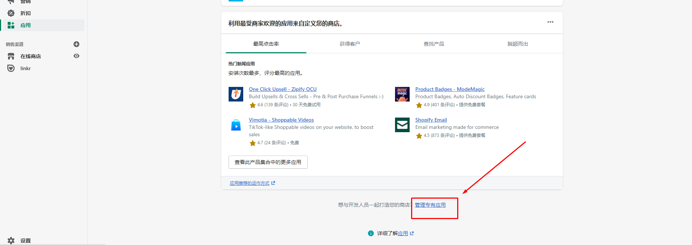
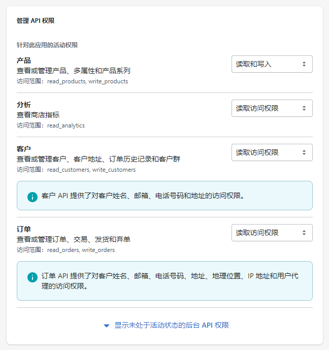
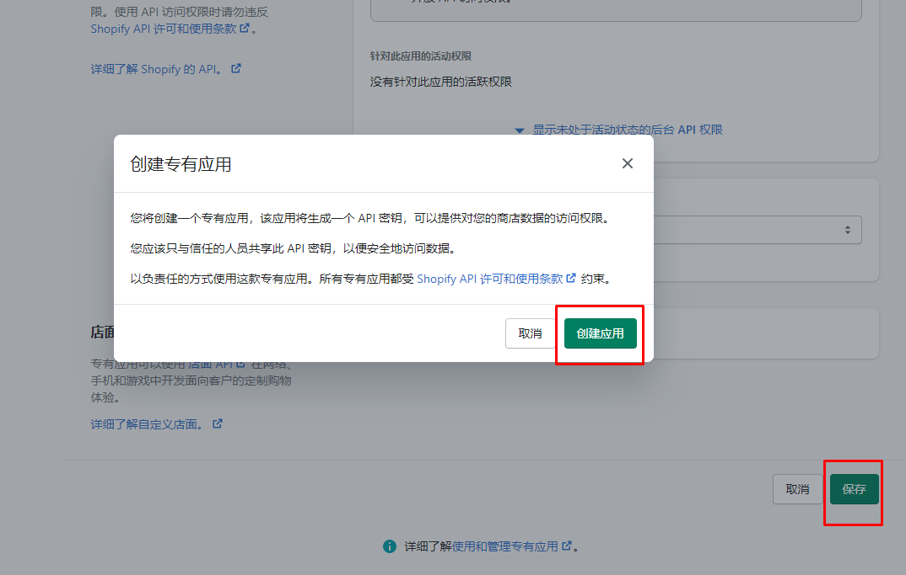

# Shopify店铺 手动授权

## **手动授权**

注：授权店铺登录账户必须为店铺创建者

注：授权前请先登录 dropseek 后台

1. 进入 **shopify** 店铺后台->应用

.jpeg>)

2\. 进入【使用和管理专有应用】或【管理私人应用】

* 确认开启私人应用

.jpeg>)

3\. 点击【创建新的私人应用】

 (1).jpeg>)

4\. 填写私人应用名称以及联系人邮箱。（邮箱和名称可以自行填写）

 (1) (1).jpeg>)

5\. 给予 **Admin API** 对应权限**/4** 个。注意：**产品 **的权限为** 读取和写入！！！**

6\. 保存，确认创建 **APP**

7\. 私人应用创建完成

.jpeg>)

8\. 创建完成后获取到 **Admin API** 中的 **password**

 (1) (1).jpeg>)

9\. 进入 **dropseek** 后台，登录

.jpeg>)

10\. 进入导航栏**->**店铺授权，点击【增加店铺】

.jpeg>)

11\. 输入店铺名以及之前获取到的 **Admin API** 中的 **password**，确认

注：password 需明文显示后复制

12\. 授权成功，完成

 (1) (1).png>)
