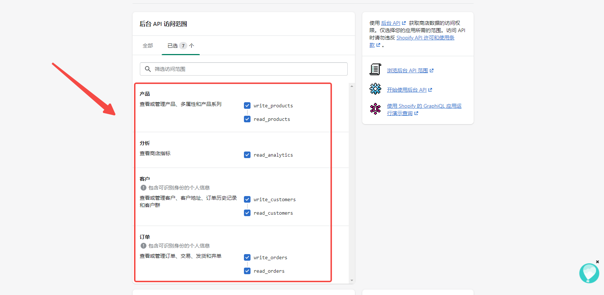
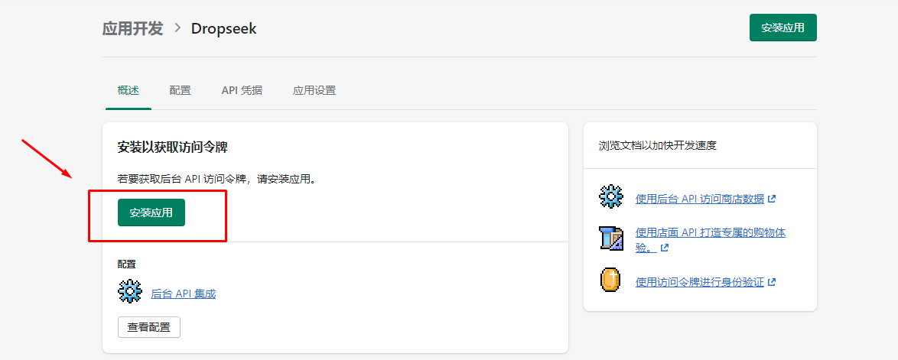
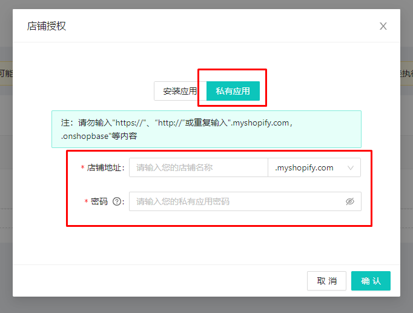
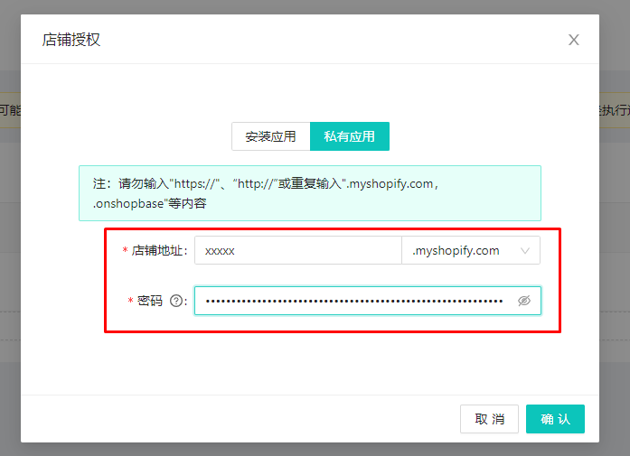

# Shopify店铺 手动授权

## **手动授权**

注：授权店铺登录账户必须为店铺创建者

注：授权前请先登录 dropseek 后台

1.进入 **shopify** 店铺后台->应用

2\. 点击【开发应用】

* 点击【允许自定义应用开发】

3\. 点击【创建应用】

4\. 填写私人应用名称以及联系人邮箱。（邮箱和名称可以自行填写）

5\. 配置后台API访问范围，给予 **Admin API** 对应权限**/4** 个。

6.配置完成后，点击【安装应用】

8\. 安装完成后，进入【API凭据】，获取API范围令牌

.png>)

9\. 进入 **dropseek** 后台，登录

.jpeg>)

10\. 进入导航栏**->**店铺授权，点击【增加店铺】

.jpeg>)

11\. 输入店铺名以及之前获取到的 **Admin API** 中的秘钥，确认

注：秘钥需明文显示后复制

12\. 授权成功，完成

 (1) (1).png>)
